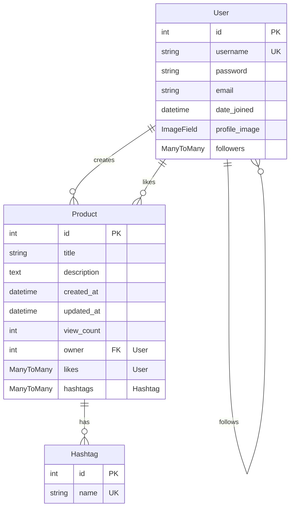

# Sparta Market ERD

## 테이블 설명

### User (사용자)
- 기본 Django AbstractUser 모델을 확장
- **Fields:**
  - id: 기본 키
  - username: 고유한 사용자 이름
  - password: 암호화된 비밀번호
  - email: 이메일 주소
  - date_joined: 가입일
  - profile_image: 프로필 이미지 (기본값: user.png)
  - followers: 팔로워 관계 (다대다)

### Product (상품)
- **Fields:**
  - id: 기본 키
  - title: 상품 제목
  - description: 상품 설명
  - created_at: 생성일
  - updated_at: 수정일
  - view_count: 조회수
  - owner: 작성자 (User 외래 키)
  - likes: 찜한 사용자 (User 다대다)
  - hashtags: 해시태그 (Hashtag 다대다)

### Hashtag (해시태그)
- **Fields:**
  - id: 기본 키
  - name: 해시태그 이름 (고유값)

## 관계 설명

1. **User - Product (작성)**
   - 일대다 관계
   - 한 사용자는 여러 상품을 등록할 수 있음
   - related_name: 'my_products'

2. **User - Product (찜하기)**
   - 다대다 관계
   - 한 사용자는 여러 상품을 찜할 수 있음
   - 한 상품은 여러 사용자에게 찜될 수 있음
   - related_name: 'liked_products'

3. **User - User (팔로우)**
   - 다대다 관계 (자기참조)
   - 한 사용자는 여러 사용자를 팔로우할 수 있음
   - related_name: 'following'

4. **Product - Hashtag**
   - 다대다 관계
   - 한 상품은 여러 해시태그를 가질 수 있음
   - 한 해시태그는 여러 상품에 사용될 수 있음
   - related_name: 'products'
